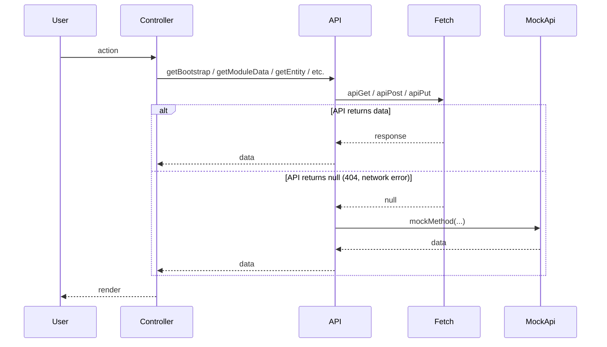
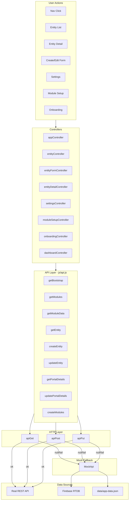
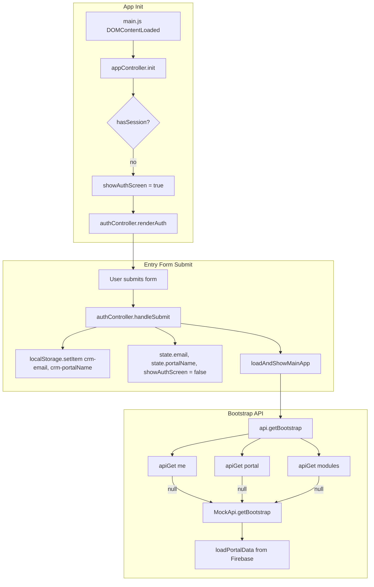
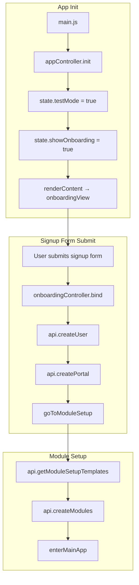
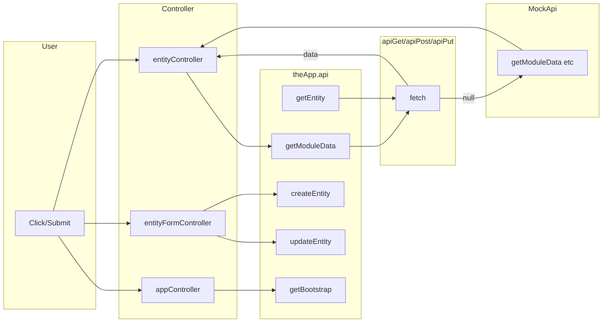

# API Call Stack Explanation

## API Calls Flow (Quick Reference)

Ordered sequence of API calls by user journey. Base URL: `{baseURL}/api/v1/portals/{portalName}/` unless marked `(root)`.

### Journey 1: Release Mode – Entry → Main App

| # | Trigger | API Method | HTTP | Endpoint |
|---|---------|------------|------|----------|
| 1 | Entry form submit → loadAndShowMainApp | getBootstrap | GET | `me` |
| 2 | (parallel) | getBootstrap | GET | `portal` |
| 3 | (parallel) | getBootstrap | GET | `modules?locale=` |

### Journey 2: Test Mode – Onboarding Signup → Module Setup → Main App

| # | Trigger | API Method | HTTP | Endpoint |
|---|---------|------------|------|----------|
| 1 | Signup form submit | createUser | POST | `api/v1/users` (root) |
| 2 | After createUser | createPortal | POST | `api/v1/portals` (root) |
| 3 | Module setup screen load | getModuleSetupTemplates | GET | `module-setup-templates?locale=` |
| 4 | User clicks Finish | createModules | POST | `modules` |
| 5 | enterMainApp (if no modules from setup) | getBootstrap | GET | `me`, `portal`, `modules` |

### Journey 3: Main App – Entity List

| # | Trigger | API Method | HTTP | Endpoint |
|---|---------|------------|------|----------|
| 1 | User selects module / page change / filter / sort | getModuleData | GET | `{moduleId}?page=&limit=&search=&sortBy=&sortOrder=` |
| 2 | For each reference field in module | getModuleFieldOptions | GET | `{refModuleId}?page=1&limit=500` |

### Journey 4: Entity Detail

| # | Trigger | API Method | HTTP | Endpoint |
|---|---------|------------|------|----------|
| 1 | User clicks row | getEntity | GET | `{moduleId}/{entityId}` |

### Journey 5: Create / Edit Entity

| # | Trigger | API Method | HTTP | Endpoint |
|---|---------|------------|------|----------|
| 1 | Create form submit | createEntity | POST | `{moduleId}` |
| 2 | Edit form submit | updateEntity | PUT | `{moduleId}/{entityId}` |

### Journey 6: Settings

| # | Trigger | API Method | HTTP | Endpoint |
|---|---------|------------|------|----------|
| 1 | Settings screen load | getPortalDetails | GET | `portal` |
| 2 | Org save | updatePortalDetails | PUT | `portal` |
| 3 | Module list (fields tab) | getModules | GET | `modules?locale=` |
| 4 | Add module | createModule | POST | `modules` |
| 5 | Rename module | updateModule | PUT | `modules/{moduleId}` |

### Journey 7: Dashboard

| # | Trigger | API Method | HTTP | Endpoint |
|---|---------|------------|------|----------|
| 1 | Per dashboard section | getModuleData | GET | `{moduleId}?page=1&limit=N` |

### Single-Call Flow Diagram

---

## Architecture Overview

The app uses a **fetch-first, mock-fallback** pattern: every data operation tries the real HTTP API first; if it fails (404, network error, or invalid response), it falls back to `MockApi` which reads from in-memory data (loaded from `data/app-data.json` or Firebase in release mode).

---

## Call Stack from Signup/Login

There are two entry flows depending on mode. Both end up making API calls.

### Path A: Release Mode – Entry Form (Email + Portal)

Used when the user is **not** in test mode and has no session. This is the "login" equivalent.

**Step-by-step:**

1. **main.js** → `appController.init()`
2. **appController.init()** – `state.testMode` false, `hasSession` false (no `crm-email` / `crm-portalName` in localStorage) → `state.showAuthScreen = true`
3. **renderContent()** → `authController.renderAuth()` → [authView.js](authView.js) renders email + portal name form
4. **User submits** → `authController.bind` → form `submit` → `handleSubmit(email, portalName, useTestMode)`
5. **handleSubmit** – localStorage: `crm-email`, `crm-portalName`; state: `email`, `portalName`, `showAuthScreen = false`; then `loadAndShowMainApp()`
6. **loadAndShowMainApp** → `api.getBootstrap({ locale, portalName })` → 3× `apiGet` (me, portal, modules) → on null → `MockApi.getBootstrap` → `loadPortalData(portalName)` (Firebase) → `runBootstrap` → `{ user, portal, modules }`
7. **loadAndShowMainApp** (continued) – sets `state.currentUser`, `state.portal`, `state.modules`; `setupTopbarForMainApp()`; `renderContent()` → main app

**Returning user (has session):** `init` → `hasSession` true → `loadAndShowMainApp()` directly (skip entry form).

---

### Path B: Test Mode – Onboarding Signup

Used when `crm-testMode === "true"` (test mode). Shows onboarding signup form (userName, userEmail, orgName).

**Step-by-step:**

1. **main.js** → `appController.init()`
2. **appController.init()** – `state.testMode` true → `state.showOnboarding = true` → `renderContent()` → [onboardingView.js](view/onboardingView.js) signup form
3. **User submits** → [onboardingController.js](controller/onboardingController.js) `bind` → form `submit`
4. **createUserThenPortal** → `api.createUser(userData)` → `apiPost("users", data, { root: true })` → on null → `MockApi.setCurrentUser`
5. **createPortal** → `api.createPortal(portalData)` → `apiPost("portals", data, { root: true })` → on null → `MockApi.updatePortalDetails`
6. **goToModuleSetup** → `state.showModuleSetup = true` → `renderContent()` → module setup view
7. **Module setup** → `api.getModuleSetupTemplates` → `apiGet("module-setup-templates")` → on null → `MockApi.getModuleSetupTemplates`
8. **User clicks Finish** → `api.createModules(modules)` → `apiPost("modules", { modules })` → on null → `MockApi.createModules`
9. **enterMainApp** → `api.getBootstrap` (if needed) → main app

---

### Path C: Entry Form "Use Test Mode" Checkbox

If the user checks "Use test mode" on the release-mode entry form and submits:

- **authController.handleSubmit** → `useTestMode` true → `switchToTestMode()` → `localStorage.setItem("crm-testMode", "true")` → `location.reload()`
- Reload → **appController.init** → `state.testMode` true → Path B (onboarding)

---

## Entry Point and Bootstrap

**Script load order** ([index.html](../index.html)): `config.js` → `api.js` → `state.js` → views → controllers → `appController.js` → `main.js`

1. **main.js** – On `DOMContentLoaded`, calls `theApp.controller.app.init()`.
2. **appController.init()** – Bootstraps the app:
   - Test mode: shows onboarding.
   - Release mode with session: calls `loadAndShowMainApp()`.
   - Release mode without session: shows entry form (email + portal).

3. **loadAndShowMainApp()** – Calls `api.getBootstrap({ locale, portalName })` to load user, portal, and modules in parallel.

---

## API Client Layer ([api.js](api.js))

### URL Construction

- **Base path**: `{config.api.baseURL}/api/{config.api.version}/portals/{portalName}`
- **Portal name**: `state.portalName` (from localStorage) or `config.api.portalName` or `"default"`

### Test Mode Short-Circuit

- If `localStorage["crm-testMode"] === "true"` or `state.testMode === true`, `apiGet`/`apiPost`/`apiPut` return `Promise.resolve(null)` immediately (no HTTP). All reads/writes go through MockApi.

### Fallback Helpers

- **tryRead(apiPromise, isValid, mockMethod, ...mockArgs)** – If API returns null or fails `isValid`, calls `MockApi[mockMethod](...mockArgs)`.
- **tryCreate(apiPromise, mockMethod, ...mockArgs)** – Same for create (POST).
- **tryUpdate(apiPromise, mockMethod, ...mockArgs)** – Same for update (PUT).

---

## Call Stack by Feature

### 1. Bootstrap (App Load / After Auth)

| Caller | API Method | HTTP | MockApi Fallback |
|--------|------------|------|------------------|
| appController.loadAndShowMainApp | getBootstrap | GET me, portal, modules (parallel) | getBootstrap (returns { user, portal, modules }) |
| appController (locale change) | getBootstrap | same | same |
| appController.enterMainApp | getBootstrap | same | same |

**Flow**: `loadAndShowMainApp` → `api.getBootstrap` → 3× `apiGet` → on null/fail → `MockApi.getBootstrap` → `loadPortalData(portalName)` (Firebase) or local data → `runBootstrap` → `{ user, portal, modules }`.

---

### 2. Entity List (Module with Fields)

| Caller | API Method | HTTP | MockApi Fallback |
|--------|------------|------|------------------|
| entityController.fetchEntityPage | getModuleData | GET {moduleId}?page&limit&filters&sortBy&sortOrder | getModuleData |
| entityController (filter/pagination/sort) | getModuleData | same | same |
| entityController.ensureModuleFieldOptions | getModuleFieldOptions | GET {refModuleId}?page=1&limit=500 | getModuleFieldOptions |

**Flow**: User selects module → `appController.renderContent` → `entityController.fetchEntityPage` → `getEntityData(moduleId)` (state cache) → if `data.list` null or filters applied → `api.getModuleData` → `apiGet(moduleId, params)` → on null → `MockApi.getModuleData(moduleId, options)`.

---

### 3. Entity Detail (Single Record)

| Caller | API Method | HTTP | MockApi Fallback |
|--------|------------|------|------------------|
| appController.renderContent | getEntity | GET {moduleId}/{entityId} | getEntity |

**Flow**: User clicks row → `state.activeEntity = { moduleId, entityId }` → `renderContent` → `api.getEntity(moduleId, entityId)` → `tryRead(apiGet(...), isValid, "getEntity", moduleId, entityId)`.

---

### 4. Create / Edit Entity

| Caller | API Method | HTTP | MockApi Fallback |
|--------|------------|------|------------------|
| entityFormController (create) | createEntity | POST {moduleId} | createEntity |
| entityFormController (edit) | updateEntity | PUT {moduleId}/{entityId} | updateEntity |

**Flow**: Form submit → `entityFormController` → `api.createEntity` or `api.updateEntity` → `tryCreate`/`tryUpdate` → on null → `MockApi.createEntity`/`updateEntity` → `persistToFirebase` (release mode).

---

### 5. Settings (Portal, Modules)

| Caller | API Method | HTTP | MockApi Fallback |
|--------|------------|------|------------------|
| settingsController (org save) | updatePortalDetails | PUT portal | updatePortalDetails |
| settingsController (module list) | getModules | GET modules | getModules |
| settingsController (add module) | createModule | POST modules | createModule |
| settingsController (rename module) | updateModule | PUT modules/{id} | updateModule |
| appController.renderContent (settings) | getPortalDetails | GET portal | getPortalDetails |

---

### 6. Module Setup (Onboarding)

| Caller | API Method | HTTP | MockApi Fallback |
|--------|------------|------|------------------|
| appController.renderContent | getModuleSetupTemplates | GET module-setup-templates?locale | getModuleSetupTemplates |
| moduleSetupController (Finish) | createModules | POST modules (batch) | createModules |

---

### 7. Onboarding (First-Time Setup)

| Caller | API Method | HTTP | MockApi Fallback |
|--------|------------|------|------------------|
| onboardingController | createUser | POST users (root) | setCurrentUser |
| onboardingController | createPortal | POST portals (root) | updatePortalDetails |

---

### 8. Dashboard

| Caller | API Method | HTTP | MockApi Fallback |
|--------|------------|------|------------------|
| dashboardController | getModuleData | GET {moduleId}?page=1&limit=N | getModuleData |

---

## State and Data Flow

- **getEntityData(moduleId)** ([model/state.js](model/state.js)) – Returns per-module cache: `{ list, total, page, filters, sortBy, sortOrder }`. Controllers read/write this; `api.getModuleData` populates `list` and `total`.

- **getModuleFields(moduleId)** – From `state.modules` + `state.moduleFieldOptions` (filled by `api.getModuleFieldOptions`).

---

## MockApi Data Flow ([../mock-api.js](../mock-api.js))

1. **tryLoadAppData()** – Fetches `data/app-data.json` (or Firebase in release mode) → `applyData` → populates `modulesObj`, `mockDataObj`, `portalDetailsStore`, `MODULE_SETUP_TEMPLATES`.
2. **Release mode** – `getBootstrap` calls `loadPortalData(portalName)` → `fetch(Firebase RTDB portals/{portalName}.json)` → merges into `mockDataObj`, `modulesObj`, `portalDetailsStore`.
3. **Writes** – `persistToFirebase(path, data)` → `fetch(Firebase RTDB PUT)` to `portals/{portalName}/...`. Test mode: no-op.

---

## Summary Diagram

---

## Key Files

| File | Role |
|------|------|
| [api.js](api.js) | API client: URL building, fetch, tryRead/tryCreate/tryUpdate, MockApi fallback |
| [../mock-api.js](../mock-api.js) | Mock implementation: getBootstrap, getModuleData, getEntity, createEntity, updateEntity, etc.; Firebase persist |
| [model/state.js](model/state.js) | getEntityData (per-module cache), getModuleFields |
| [controller/appController.js](controller/appController.js) | Bootstrap, routing, getBootstrap, getEntity, getModuleSetupTemplates |
| [controller/entityController.js](controller/entityController.js) | getModuleData, getModuleFieldOptions |
| [controller/entityFormController.js](controller/entityFormController.js) | createEntity, updateEntity |
| [controller/settingsController.js](controller/settingsController.js) | getPortalDetails, updatePortalDetails, getModules, createModule, updateModule |
| [controller/moduleSetupController.js](controller/moduleSetupController.js) | createModules, getModuleSetupTemplates |
| [controller/dashboardController.js](controller/dashboardController.js) | getModuleData |
